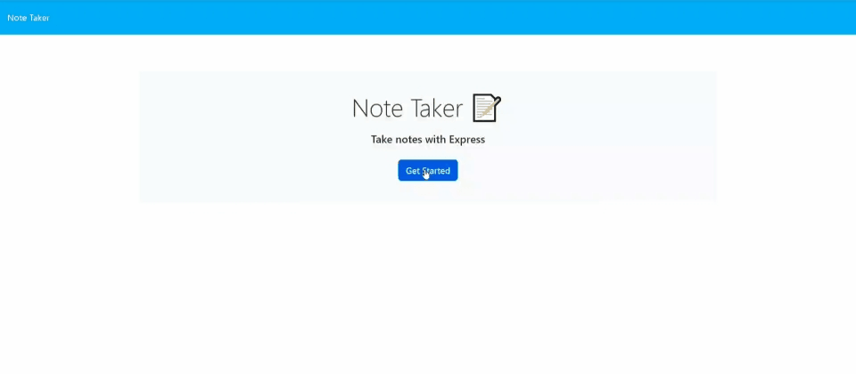

# Note Taker

## Description

This Note Taker app helps you write and save notes so that you can organize your thoughts and keep track of tasks you need to complete.

## Technologies Used:

- HTML
- CSS
- Js
- Express.js
- Bootstrap

## How to Use

When you open the Note Taker app, then you are presented with a landing page with a link to a notes page. When you click on the link to the notes page, then you are presented with a page with existing notes listed in the left-hand column, plus empty fields to enter a new note title and the note’s text in the right-hand column.
Enter a new note title and the note’s text, then press "Save Note" button in the navigation at the top of the page, 
The new note you have entered is saved and appears in the left-hand column with the other existing notes. You can also delete the note by pressing the delete icon.
 
 

## Links

- [The URL of the deployed website :arrow_right:](https://shrouded-tor-81089-8c84712b5f16.herokuapp.com/)

## App Demo

The following is a demo of the deployed website.

## Credits

- USYD-Bootcamp (week 11 class activities)
